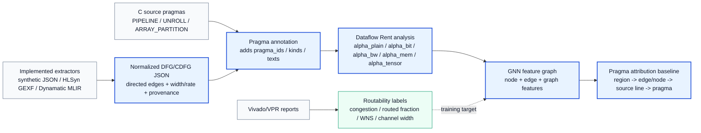

# hls-rent

Rent-aware dataflow communication scaling for early HLS routability prediction.

This project extends classical Rent-style analysis from undirected netlists to
directed, weighted, streaming dataflow graphs. The goal is to predict future
physical routability earlier in the HLS flow and explain the risk back to C
source constructs such as loops, arrays, and pragmas.

## Implemented Flow



Highlighted path:

```text
normalized DFG/CDFG
  -> pragma annotation
  -> dataflow Rent features
  -> GNN feature graph
  -> pragma-level attribution
```

Implemented label path:

```text
Vivado/VPR reports -> routability labels -> supervised GNN target
```

Main code lives in [`dataflow_comm_scaling/`](dataflow_comm_scaling/README.md).
