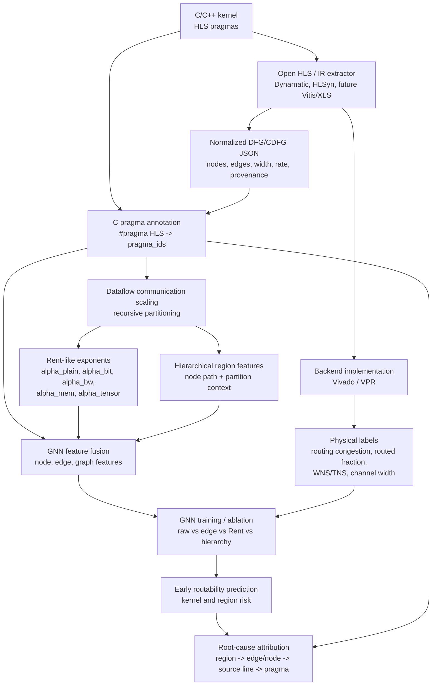

# hls-rent

Rent-aware dataflow communication scaling for early HLS routability prediction.

This project extends classical Rent-style analysis from undirected netlists to
directed, weighted, streaming dataflow graphs. The goal is to predict future
physical routability earlier in the HLS flow and explain the risk back to C
source constructs such as loops, arrays, and pragmas.

## Flowchart



## Current Pipeline

```text
source kernel + pragmas
  -> normalized dataflow graph
  -> pragma provenance annotation
  -> dataflow/Rent communication features
  -> PyG-ready GNN graph
  -> backend routability labels
  -> prediction and pragma-level attribution
```

Main code lives in [`dataflow_comm_scaling/`](dataflow_comm_scaling/README.md).
